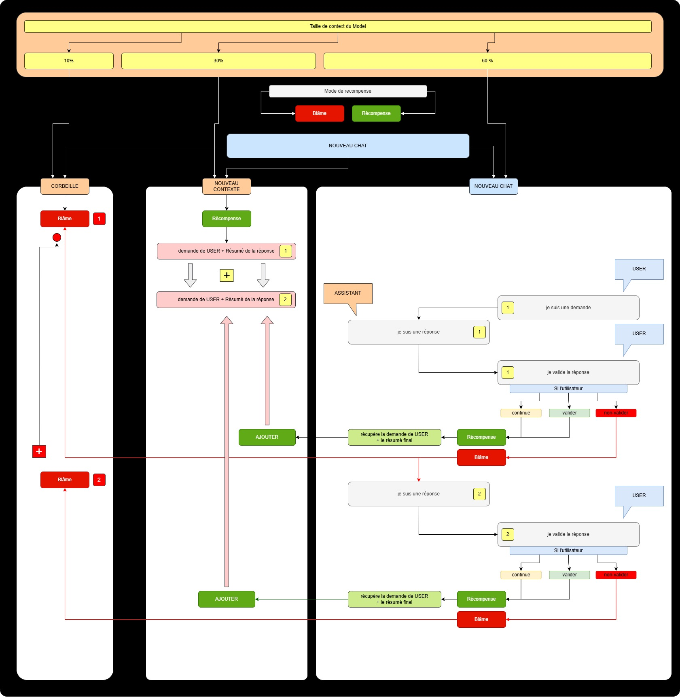

# French Team AI & Codyman

**Réunir les codeurs français pour révolutionner l'utilisation de l'IA**


---
[Presentation du Projet sur Youtube : ici](https://www.youtube.com/watch?v=0iMMNdhO5_I)
---

Bienvenue dans le projet **Codyman & French Team AI**, où nous visons à rassembler les développeurs français passionnés par l'intelligence artificielle (IA). Si vous êtes intéressé(e) par des projets innovants qui transforment la manière dont l'IA est utilisée, vous êtes au bon endroit !

---

## À propos du Projet

Le monde de l'IA évolue rapidement, mais il manque encore un élément crucial : un **centre de contrôle et d'assistance IA** capable de coordonner et optimiser les efforts des assistants IA et des serveurs MCP (Multi-Cloud Platforms). Notre mission est de combler ce vide en créant un outil puissant qui permettra aux développeurs de gérer leurs projets avec précision et efficacité <button class="citation-flag" data-index="1">.

### Nos Objectifs :
- Créer un centre de commandes pour les agents IA.
- Développer un système de surveillance avancé pour les serveurs MCP.
- Offrir une interface utilisateur intuitive pour scanner, analyser et modifier vos projets.
- Introduire **Codestral**, un chat intégré pour collaborer et superviser vos projets en temps réel.

---
### Boite a idée


---

---
## Pourquoi Rejoindre French Team AI ?

L'IA est partout, mais elle nécessite des outils robustes pour être pleinement exploitée. Avec notre plateforme, vous pourrez :
- Suivre en temps réel les modifications apportées par votre assistant IA.
- Réduire la consommation de tokens grâce à une gestion optimisée du contexte.
- Automatiser des tâches telles que l'écriture de tests, leur exécution, et leur correction.
- Tenir à jour la mémoire de votre assistant IA sans effort supplémentaire.

En résumé, nous fournissons les outils nécessaires pour transformer vos idées en réalité tout en minimisant les complications techniques.

---
## Interface v2

---
## Interface v1

---

## Fonctionnalités Clés

### Centre de Contrôle
- Supervision des actions des agents IA.
- Analyse et correction automatique des modifications.
- Gestion des serveurs MCP pour garantir une performance optimale.

### Centre d'Assistance
- Chat Codestral pour discuter et collaborer avec votre assistant IA.
- Commandes personnalisées pour automatiser les tâches répétitives.
- Rapports détaillés sur l'état de vos projets.

---

## Comment Ça Marche ?

1. **Création du Projet** : Votre assistant IA crée votre projet et introduit progressivement plus de contexte pour améliorer les résultats.
2. **Optimisation des Tokens** : Les serveurs MCP sont utilisés pour réduire la consommation de ressources tout en augmentant la qualité des réponses.
3. **Contrôle Centralisé** : Notre centre de contrôle prend en charge toutes les opérations complexes, vous permettant de vous concentrer sur l'essentiel.
4. **Résultats Complets** : Tests automatisés, corrections intelligentes, et rappels contextualisés pour garantir la réussite de vos projets.

---

## Contribuer au Projet

Vous souhaitez rejoindre notre communauté et contribuer à l'avenir de l'IA ? Voici comment procéder :

1. **Clonez le dépôt** :
   ```bash
   git clone https://github.com/French-Team/system-control-assistant.git

